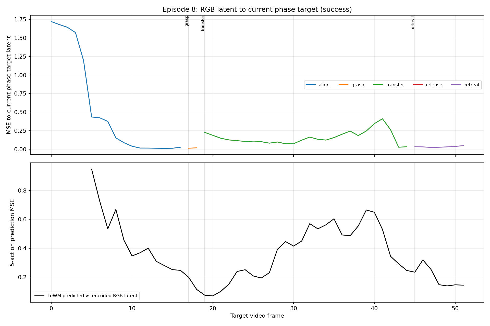

# LeWorldModel
### Stable End-to-End Joint-Embedding Predictive Architecture from Pixels

> **本地实验归档（2026-08-05）**
>
> 本仓库在上游 LeWM 代码之上增加了 PushT 长时序验证、Cube 机械臂规划、
> Actor/LeWM MPC、视觉语义状态机和在线 Actor 更新等实验。当前主要归档实验为
> [`latent_three_phase_mpc`](experiments/cube_robot/experiments/latent_three_phase_mpc/README.md)，
> 其中记录了可复现命令、配置、检查点、视频、成功率和已知限制。下方先给出
> 本地实验演示与总结，随后英文内容保留为上游项目说明。

## 从短期 LeWM 到长期机械臂任务

本项目首先复现原生 LeWM 的视觉世界模型规划流程，然后研究一个更具挑战的问题：
**能否让仅用短期动作窗口训练的 LeWM，在不重新训练世界模型的条件下，辅助机械臂完成
完整的长期夹取和转移任务？**

我们的工作经历了三个阶段：复现并发现问题、围绕根因设计新架构、通过改造前后实验验证。

## 1. 复现 LeWM 与问题发现

### 原生规划方式

原生 LeWM 将当前 RGB 和目标 RGB 编码到 latent 空间。CEM 从动作分布中采样候选动作链，
LeWM 预测每条动作链执行后的 latent，规划器选择预测结果最接近目标 latent 的动作链：

```text
当前 RGB -> encoder -> 当前 latent z_t
目标 RGB -> encoder -> 目标 latent z_g
                          |
CEM 采样动作链 ----------+
                          v
                 LeWM 预测未来 latent
                          |
                 最小化 latent(z_hat, z_g)
                          |
                  执行动作并闭环重规划
```

在 Cube 固定任务复现中，目标取专家轨迹第 25 步，规划器每次评估
`horizon=5`、`action_block=5`，即 25 个原始动作；CEM 每轮采样 300 条动作链、
优化 30 轮并保留前 30 条，环境最多允许执行 50 步。对应结果记录在
`experiments/cube_robot/outputs/fixed_task/fixed_task_results.json`，该回合
`agent_success=false`。

### 长任务中的核心问题

把目标扩展到完整夹取和转移任务后，机械臂常在开始阶段可以运动，随后出现停滞、重复动作、
抓握失败或接近目标后再次离开。增加 CEM 样本数、迭代次数和总执行预算没有稳定解决问题。

我们进一步计算了所有专家轨迹中，每帧 RGB latent 与最终目标帧 latent 的 MSE：


横轴是专家轨迹步长，纵轴是当前帧 latent 与最终目标 latent 的 MSE。各条专家轨迹及其
平均曲线均不是单调下降。即使专家正在执行正确动作，latent 距离也可能暂时增大，例如机械臂
需要先抬升、绕行、重新对齐或调整夹爪姿态。

这说明问题是**长期规划目标与短期任务进度不一致**：

1. LeWM latent 为视觉动力学预测而训练，不是任务语义上的严格距离度量。
2. 背景、机械臂、夹爪和物块共同影响 latent；latent 接近不等于物块精确对齐或已经抓稳。
3. 长期必要动作可能暂时增大最终目标 latent MSE，因此会被只看终点距离的规划器拒绝。
4. CEM 只在当前动作分布附近搜索。当候选链得分趋同，增加采样只能扩大局部搜索，
   不能修复评价函数本身，规划器仍可能陷入局部最优。
5. 每次执行后重新读取真实 RGB 能修正模型状态，却不能让一个非单调的长期目标自动变得单调。

## 2. 无需重训 LeWM 的新架构

### 设计原则

我们不修改也不重新训练 LeWM，而是将其限制在擅长的职责：**预测约 25 步范围内的短期
latent 动力学**。长期任务的语义分解、长期价值和失败恢复由世界模型外部的新模块承担。

### 总体架构

```text
当前 RGB I_t                    最终目标 RGB I_g
      |                                |
      +------ 冻结 LeWM encoder -------+
                     |
         z_prev, z_t, z_g ∈ R^192
                     |
          VisualSemanticNet
       六个语义谓词概率 p_t ∈ R^6
                     |
       可恢复五阶段状态机 s_t
 align -> grasp -> transfer -> release -> retreat
                     |
           RecoveryTargetNet
       当前阶段目标 z_phase ∈ R^192
                     |
         RecoveryBlockActor
        产生 5×5 动作 block 先验
                     |
       96 条候选 × 5 个 block
       = 96×25×5 候选动作张量
                     |
          冻结 LeWM 短期推演
       预测 latent 链 96×5×192
                     |
       RecoveryValueEnsemble + MPC
 短期目标误差、长期价值、不确定性、动作先验、平滑度
                     |
         选取 elite 候选并融合
                     |
          仅执行第 1 个真实动作
                     |
       MuJoCo/真实系统返回新 RGB
                     |
    重新编码、重新判断阶段、重新规划
                     |
    优质真实转移进入 replay，在线蒸馏 Actor
```

### 模块输入输出

| 模块 | 输入 | 输出 | 作用 |
| --- | --- | --- | --- |
| 冻结 LeWM encoder | 当前、上一帧和目标 RGB | `z_prev,z_t,z_g ∈ R^192` | 将 RGB 映射到统一 latent 空间 |
| `VisualSemanticNet` | `[z_prev,z_t,z_g,z_t-z_g] ∈ R^768` | 6 个谓词 logits | 识别 `aligned/grasped/near_goal/released/retreated/complete` |
| 可恢复状态机 | 谓词概率、连续确认帧数、状态超时 | 5 状态 one-hot | 管理 `align/grasp/transfer/release/retreat`，允许失败回退 |
| `RecoveryTargetNet` | 上一/当前/最终 latent 与阶段 one-hot | `z_phase ∈ R^192` | 将长期目标转换为当前约 25 步可达的阶段目标 |
| `RecoveryBlockActor` | 当前上下文、阶段目标、最终目标和阶段 | `5×5` 动作 block | 给候选搜索提供具有行为先验的动作均值 |
| 冻结 LeWM dynamics | `z_t` 与归一化 `5×5` 动作 block | 下一 block 的 `z_hat ∈ R^192` | 在 latent 中预测短期动作结果 |
| `RecoveryValueEnsemble` | 上一/当前/阶段目标/最终目标 latent 与阶段 | 价值均值和不确定性 | 评估候选状态对完整任务的长期价值 |
| MPC | 96 条候选动作链及其 latent 链 | elite 融合动作链 | 联合短期可达性、长期价值和动作合理性选择动作 |
| 在线 Actor 更新 | 通过真实 RGB 进度筛选的状态-动作样本 | 更新后的 Actor | 用优质真实转移蒸馏策略，同时用 BC anchor 限制漂移 |

### 一次规划周期

1. 冻结 encoder 将上一帧、当前帧和最终目标图像编码为三个 192 维 latent。
2. 视觉语义网络预测 6 个谓词，状态机据此确定当前是 `align`、`grasp`、
   `transfer`、`release` 还是 `retreat`。
3. 阶段目标网络输出当前阶段的 192 维短期目标，而不是直接要求当前状态追逐最终目标。
4. Actor 输出一个 `5×5` 动作 block。在每个候选预测 latent 上重复调用 Actor 5 次，
   形成 `25×5` 动作链；加入探索噪声后得到 `96×25×5` 候选动作张量。
5. LeWM 每次接收一个 `5×5` block，连续推演 5 次，产生每条候选链的 5 个 block
   端点 latent，即 `96×5×192` 的预测 latent 链。
6. 使用以下联合目标评分候选链：

```text
score =
  - 0.75 × 阶段终点 latent 误差
  + 0.90 × 终点长期价值
  + 0.20 × 路径平均长期价值
  - 0.20 × Critic 不确定性
  - 6.00 × 偏离 Actor 先验的幅度
  - 0.01 × 动作不平滑程度
```

7. 对前 8 条 elite 动作链加权融合。正式配置只执行第一个真实动作，随后读取新 RGB，
   因此不会把整条 25 步模型预测盲目地开环执行。
8. 若真实新 RGB 同时满足规划优势、语义进度和安全条件，该状态-动作对进入 replay；
   Actor 以 `1e-6` 学习率在线更新，并使用系数 `1.0` 的 BC anchor 保持原策略能力。

### 训练与推理边界

训练语义网络、阶段目标、Actor 和 Critic 时，可以使用 MuJoCo 坐标生成
`aligned/grasped/near_goal/released/retreated/complete` 等监督标签。推理和在线规划阶段不读取这些
精确坐标，只使用当前 RGB、目标 RGB、冻结 LeWM latent 和学习到的视觉网络。仿真器原生
`success` 仅用于最终实验统计。

LeWM 参数在整个新架构中保持冻结。我们训练的是它外部的任务语义、价值评估和动作提议模块，
因此不需要重新收集像素动力学数据，也不需要重新训练世界模型。

### 为什么新架构能处理长期任务

- **短期可达性**：阶段目标把非单调的最终目标转换为 LeWM 可靠视野内的短期目标。
- **长期方向**：Critic 判断候选 latent 是否对完整任务有长期价值，不只看当前 latent MSE。
- **动作合理性**：Actor 提供连续、接近示范分布的动作先验，避免完全随机搜索。
- **真实闭环**：每执行一步就用真实新 RGB 重置规划起点，限制世界模型误差累积。
- **失败恢复**：状态机发现未对齐、抓握丢失或阶段超时后能够回退并重新尝试。
- **在线适应**：真实执行后确认有效的动作继续蒸馏 Actor，使动作先验逐步适应当前任务。

## 3. 改造前后成果对比

### 改造前：原生 LeWM + CEM 固定目标

该视频对应 `single-cube horizontal pick-and-place` 基线：目标为专家第 25 步，
执行预算 50 步，最终未完成任务。

<video controls width="800">
  <source src="experiments/cube_robot/outputs/fixed_task/agent_short_panel.mp4" type="video/mp4">
</video>

[播放或下载改造前基线视频](experiments/cube_robot/outputs/fixed_task/agent_short_panel.mp4)

### 改造后：五阶段 RGB-Latent MPC

该视频来自五阶段恢复状态机历史最佳实验第 8 回合。机械臂在分阶段框架下完成抓取、
转移和释放，并通过完整任务成功判定。视频画面来自 MuJoCo 真实仿真渲染，LeWM 只参与
候选动作链的 latent 预测和评分。

<video controls width="800">
  <source src="experiments/cube_robot/experiments/latent_three_phase_mpc/outputs/videos/recovery_state_machine_continue_round2/recovery_online_episode_8_success.mp4" type="video/mp4">
</video>

[播放或下载改造后成功视频](experiments/cube_robot/experiments/latent_three_phase_mpc/outputs/videos/recovery_state_machine_continue_round2/recovery_online_episode_8_success.mp4)

### 成功回合诊断



该图对照真实 RGB latent、当前阶段目标 latent，以及 LeWM 预测 latent 与执行后真实
latent 的误差，用于验证新架构没有要求最终目标 latent 距离全程单调下降，而是在各阶段
内部使用短期预测，并通过真实 RGB 闭环进入下一阶段。

| 对比项 | 改造前基线 | 新架构 |
| --- | --- | --- |
| 世界模型 | 冻结 LeWM | 同一个冻结 LeWM，无需重新训练 |
| 目标 | 单个固定目标 latent | 五阶段短期目标 + 最终目标 |
| 长期评价 | 主要依赖目标 latent 差 | Critic 长期价值 + 语义进度 |
| 动作搜索 | CEM 从高斯分布搜索 | Actor 先验附近的 96 条候选链 |
| 执行方式 | 规划动作序列后执行 | 每次只执行 1 步并读取新 RGB |
| 失败处理 | 无显式任务级恢复 | 可回退状态机重新对齐和抓握 |
| 示例结果 | 固定任务失败 | 完成长时序抓取、转移和释放 |
| 历史批量结果 | `0/1` | 五阶段在线实验 `3/10` |

## 结论

**我们的架构能够辅助使用短期动作数据训练的 LeWM 完成长期机械臂任务。**

关键不是强迫原生 latent 距离在整个长任务中单调下降，也不是重新训练一个更长视野的 LeWM，
而是让冻结 LeWM 专注于短期动力学预测，再用阶段目标、视觉语义状态机、Critic 长期价值、
Actor 动作先验和真实 RGB 闭环共同组织长期行为。

这项结果证明了“短期世界模型 + 外部长程任务结构”的可行性。历史最佳成功率为 `3/10`，
同源检查点复跑为 `1/10`，因此当前系统已经展示完整任务能力，但视觉精细判定、动作候选覆盖、
在线更新稳定性和跨目标泛化仍是后续工作。

完整配置、实验表、日志字段、权威检查点和复现限制见
[RGB-Latent MPC Cube 实验归档](experiments/cube_robot/experiments/latent_three_phase_mpc/README.md)。

---

## 上游 LeWM 原始项目说明

[Lucas Maes*](https://x.com/lucasmaes_), [Quentin Le Lidec*](https://quentinll.github.io/), [Damien Scieur](https://scholar.google.com/citations?user=hNscQzgAAAAJ&hl=fr), [Yann LeCun](https://yann.lecun.com/) and [Randall Balestriero](https://randallbalestriero.github.io/)

**Abstract:** Joint Embedding Predictive Architectures (JEPAs) offer a compelling framework for learning world models in compact latent spaces, yet existing methods remain fragile, relying on complex multi-term losses, exponential moving averages, pretrained encoders, or auxiliary supervision to avoid representation collapse. In this work, we introduce LeWorldModel (LeWM), the first JEPA that trains stably end-to-end from raw pixels using only two loss terms: a next-embedding prediction loss and a regularizer enforcing Gaussian-distributed latent embeddings. This reduces tunable loss hyperparameters from six to one compared to the only existing end-to-end alternative. With ~15M parameters trainable on a single GPU in a few hours, LeWM plans up to 48× faster than foundation-model-based world models while remaining competitive across diverse 2D and 3D control tasks. Beyond control, we show that LeWM's latent space encodes meaningful physical structure through probing of physical quantities. Surprise evaluation confirms that the model reliably detects physically implausible events.

<p align="center">
   <b>[ <a href="https://arxiv.org/pdf/2603.19312v1">Paper</a> | <a href="https://huggingface.co/collections/quentinll/lewm">Checkpoints &amp; Data</a> | <a href="https://le-wm.github.io/">Website</a> ]</b>
</p>

<br>

<p align="center">
  
</p>

If you find this code useful, please reference it in your paper:
```
@article{maes_lelidec2026lewm,
  title={LeWorldModel: Stable End-to-End Joint-Embedding Predictive Architecture from Pixels},
  author={Maes, Lucas and Le Lidec, Quentin and Scieur, Damien and LeCun, Yann and Balestriero, Randall},
  journal={arXiv preprint},
  year={2026}
}
```

## Using the code
This codebase builds on [stable-worldmodel](https://github.com/galilai-group/stable-worldmodel) for environment management, planning, and evaluation, and [stable-pretraining](https://github.com/galilai-group/stable-pretraining) for training. Together they reduce this repository to its core contribution: the model architecture and training objective.

**Installation:**
```bash
uv venv --python=3.10
source .venv/bin/activate
uv pip install stable-worldmodel[train,env]
```

## Data

Datasets use the HDF5 format for fast loading. Download the data from [HuggingFace](https://huggingface.co/collections/quentinll/lewm) and decompress with:

```bash
tar --zstd -xvf archive.tar.zst
```

Place the extracted `.h5` files under `$STABLEWM_HOME` (defaults to `~/.stable-wm/`). You can override this path:
```bash
export STABLEWM_HOME=/path/to/your/storage
```

Dataset names are specified without the `.h5` extension. For example, `config/train/data/pusht.yaml` references `pusht_expert_train`, which resolves to `$STABLEWM_HOME/pusht_expert_train.h5`.

## Training

`jepa.py` contains the PyTorch implementation of LeWM. Training is configured via [Hydra](https://hydra.cc/) config files under `config/train/`.

Before training, set your WandB `entity` and `project` in `config/train/lewm.yaml`:
```yaml
wandb:
  config:
    entity: your_entity
    project: your_project
```

To launch training:
```bash
python train.py data=pusht
```

Checkpoints are saved to `$STABLEWM_HOME` upon completion.

For baseline scripts, see the stable-worldmodel [scripts](https://github.com/galilai-group/stable-worldmodel/tree/main/scripts/train) folder.

## Planning

Evaluation configs live under `config/eval/`. Set the `policy` field to the checkpoint path **relative to `$STABLEWM_HOME`**, without the `_object.ckpt` suffix:

```bash
# ✓ correct
python eval.py --config-name=pusht.yaml policy=pusht/lewm

# ✗ incorrect
python eval.py --config-name=pusht.yaml policy=pusht/lewm_object.ckpt
```

## Pretrained Checkpoints

Pretrained LeWM checkpoints for each environment are mirrored on the Hugging Face
Hub (model repos), alongside the datasets (dataset repos) in the same collection:

- [`quentinll/lewm-pusht`](https://huggingface.co/quentinll/lewm-pusht)
- [`quentinll/lewm-cube`](https://huggingface.co/quentinll/lewm-cube)
- [`quentinll/lewm-tworooms`](https://huggingface.co/quentinll/lewm-tworooms)
- [`quentinll/lewm-reacher`](https://huggingface.co/quentinll/lewm-reacher)

The full baseline checkpoint suite (PLDM, LeJEPA, IVL, IQL, GCBC, DINO-WM, DINO-WM-noprop)
is available on [Google Drive](https://drive.google.com/drive/folders/1r31os0d4-rR0mdHc7OlY_e5nh3XT4r4e):

<div align="center">

| Method | two-room | pusht | cube | reacher |
|:---:|:---:|:---:|:---:|:---:|
| pldm | ✓ | ✓ | ✓ | ✓ |
| lejepa | ✓ | ✓ | ✓ | ✓ |
| ivl | ✓ | ✓ | ✓ | — |
| iql | ✓ | ✓ | ✓ | — |
| gcbc | ✓ | ✓ | ✓ | — |
| dinowm | ✓ | ✓ | — | — |
| dinowm_noprop | ✓ | ✓ | ✓ | ✓ |

</div>

## Loading a checkpoint

### From the Drive archive

Each tar archive contains two files per checkpoint:
- `<name>_object.ckpt` — a serialized Python object for convenient loading; this is what `eval.py` and the `stable_worldmodel` API use
- `<name>_weight.ckpt` — a weights-only checkpoint (`state_dict`) for cases where you want to load weights into your own model instance

Place the extracted files under `$STABLEWM_HOME/` and load via:

```python
import stable_worldmodel as swm

# Load the cost model (for MPC)
cost = swm.policy.AutoCostModel('pusht/lewm')
```

`AutoCostModel` accepts:
- `run_name` — checkpoint path **relative to `$STABLEWM_HOME`**, without the `_object.ckpt` suffix
- `cache_dir` — optional override for the checkpoint root (defaults to `$STABLEWM_HOME`)

The returned module is in `eval` mode with its PyTorch weights accessible via `.state_dict()`.

### From the Hugging Face mirror

The HF model repos ship the LeWM checkpoint as a `weights.pt` (state dict) plus a
`config.json` describing the model. Convert once to produce the `_object.ckpt`
that `eval.py` expects:

```bash
# download weights.pt + config.json
hf download quentinll/lewm-pusht --local-dir $STABLEWM_HOME/hf_pusht

# convert to object checkpoint under $STABLEWM_HOME/pusht/lewm_object.ckpt
python - <<'PY'
import json, torch, stable_pretraining as spt
from pathlib import Path
from jepa import JEPA
from module import ARPredictor, Embedder, MLP
import stable_worldmodel as swm

src = Path(swm.data.utils.get_cache_dir(), "hf_pusht")
out = Path(swm.data.utils.get_cache_dir(), "pusht", "lewm_object.ckpt")

cfg = json.loads((src / "config.json").read_text())
encoder = spt.backbone.utils.vit_hf(
    cfg["encoder"]["size"],
    patch_size=cfg["encoder"]["patch_size"],
    image_size=cfg["encoder"]["image_size"],
    pretrained=False, use_mask_token=False,
)
mlp = lambda k: MLP(input_dim=cfg[k]["input_dim"], output_dim=cfg[k]["output_dim"],
                    hidden_dim=cfg[k]["hidden_dim"], norm_fn=torch.nn.BatchNorm1d)
model = JEPA(
    encoder=encoder,
    predictor=ARPredictor(**cfg["predictor"]),
    action_encoder=Embedder(**cfg["action_encoder"]),
    projector=mlp("projector"),
    pred_proj=mlp("pred_proj"),
)
sd = torch.load(src / "weights.pt", map_location="cpu", weights_only=False)
model.load_state_dict(sd, strict=True)
out.parent.mkdir(parents=True, exist_ok=True)
torch.save(model, out)
PY
```

After conversion, load via `swm.policy.AutoCostModel('pusht/lewm')` as usual.

## Contact & Contributions
Feel free to open [issues](https://github.com/lucas-maes/le-wm/issues)! For questions or collaborations, please contact `lucas.maes@mila.quebec`
