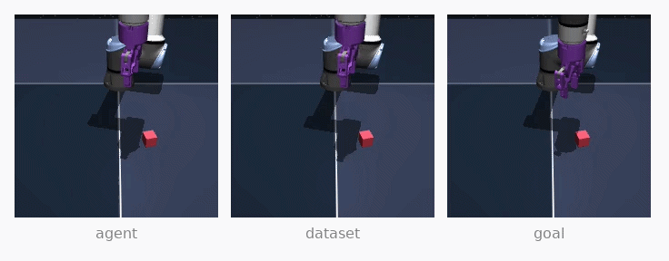
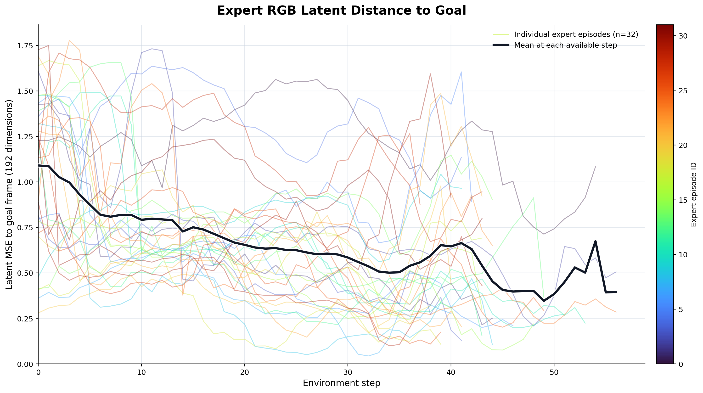

# LeWorldModel

### Stable End-to-End Joint-Embedding Predictive Architecture from Pixels

> **本地实验归档：Proprio V2（2026-08）**
>
> 本仓库在上游 LeWorldModel（LeWM）基础上研究一个问题：能否不重新训练短期视觉世界模型，仍让机械臂完成更长的抓取与转移任务？当前保留的主实验为 [Proprio V2](experiments/cube_robot/experiments/latent_three_phase_mpc/README.md)。

## 从短期 LeWM 到长期机械臂任务

本项目先复现原生 LeWM 的视觉世界模型规划流程，再研究一个更具挑战的问题：**仅用短期动作窗口训练的 LeWM，在不重新训练世界模型的条件下，辅助机械臂完成完整的长期夹取和转移任务**

研究过程分为三个阶段：复现lewm并探究其难以完成长任务的原因、根据分析结果设计新架构、用改造后的闭环系统验证抓握与转移能力。

## 1. 复现 LeWM 与问题发现

### 原生规划方式

<p align="center">
  
</p>

原生 LeWM 将当前 RGB 和目标 RGB 编码到 latent 空间。CEM 从动作分布中采样候选动作链，LeWM 预测每条动作链执行后的 latent，规划器选择预测结果最接近目标 latent 的动作链：

```text
当前 RGB -> encoder -> 当前 latent z_t
目标 RGB -> encoder -> 目标 latent z_g
                          |
CEM 采样动作链 ----------+
                          v
                 LeWM 预测未来 latent
                          |
                 最小化 distance(z_hat, z_g)
                          |
                  执行动作并闭环重规划
```

在 Cube 固定任务复现中，目标为专家轨迹 25 步后的画面。规划器使用 `horizon=5`、`action_block=5`，即评估 25 个原始动作的短期结果；环境每次只执行有限步数并重新规划。短任务中该设置能驱动有意义的机械臂运动，但它不能稳定完成完整的抓取与转移任务。

### 长任务中的核心问题

把目标扩展到完整夹取和转移任务后，机械臂常在开始阶段可以运动，随后出现停滞、重复动作、抓握失败，或接近目标后再次离开。增加 CEM 样本数、迭代次数和总执行预算并没有稳定解决问题。

我们计算了专家轨迹中每帧 RGB latent 与最终目标帧 latent 的 MSE：



横轴是专家轨迹步长，纵轴是当前帧 latent 与最终目标 latent 的 MSE。各条专家轨迹及平均曲线均不是单调下降。即使专家正在执行正确动作，latent 距离也可能暂时增大，例如机械臂需要先抬升、绕行、重新对齐或调整夹爪姿态。

这说明问题不只是 LeWM rollout 误差累积，更关键的是**规划目标与任务进度不一致**：

1. LeWM latent 为视觉动力学预测而训练，不是任务语义上的严格距离度量。
2. 背景、机械臂、夹爪和物块共同影响 latent；latent 接近不等于物块精确对齐或已经抓稳。
3. 长期必要动作可能暂时增大最终目标 latent MSE，因此会被只看终点距离的规划器拒绝。
4. CEM 只在当前动作分布附近搜索。当候选链得分趋同，增加采样只能扩大局部搜索，不能修复评价函数本身，规划器仍可能陷入局部最优。
5. 每次执行后重新读取真实 RGB 能修正模型状态，却不能让非单调的长期目标自动变为单调。

## 2. Proprio V2：无需重训 LeWM 的长程闭环架构

### 设计原则

我们不修改也不重新训练 LeWM，而是把它限制在擅长的职责：**预测约 25 个原始动作范围内的短期 latent 动力学**。长期任务的语义分解、阶段切换、价值评估和在线动作适应由 LeWM 外部模块承担。

与旧版只依赖 RGB latent 的实验相比，Proprio V2 额外向所有上层网络输入机械臂自身的 6 维本体状态：末端 XYZ、yaw 的 `cos/sin` 与夹爪闭合程度。这使模型能够区分视觉上相似但实际姿态、夹爪状态不同的情形。

### 总体架构

```text
当前 RGB、上一帧 RGB、任务目标 RGB
                |
        冻结 LeWM encoder
                |
 z_prev, z_t, z_goal (each 192D) + robot proprio (6D)
                |
  ProprioSemanticNet + ProprioTransitionNet
                |
          三阶段状态机
       ALIGN -> GRASP -> TRANSFER
                |
 ProprioTargetNet（仅 ALIGN / GRASP）
                |
     ProprioBlockActor: 5 x 5 action block
                |
       96 条候选动作链 + 冻结 LeWM rollout
                |
       Value Ensemble：长期价值与不确定性
                |
       执行第一个真实动作，重新观测并规划
                |
     优质真实转移进入 replay，在线更新 Actor
```

在线规划不读取物块坐标、目标距离或接触真值。MuJoCo 坐标与接触信息只用于离线生成监督标签和最终评测。

### 模块职责

| 模块 | 输入 | 输出 | 作用 |
| --- | --- | --- | --- |
| 冻结 LeWM encoder | RGB | 192 维 latent | 将上一帧、当前帧、目标帧编码为 `z_prev,z_t,z_goal`。 |
| `ProprioSemanticNet` | latent 时序 + 本体时序 | `aligned`、`grasped` | 识别当前是否对齐、是否抓住物块。 |
| `ProprioTransitionNet` | 视觉、本体、语义概率、阶段 | 三类阶段 logits | 为阶段状态机提供切换建议。 |
| `ProprioTargetNet` | 当前/目标 latent、阶段、本体 | `z_phase` | 为 ALIGN 与 GRASP 生成短期阶段目标。 |
| `ProprioBlockActor` | 当前、阶段目标、最终目标、本体 | `5 x 5` 动作块 | 给 MPC 提供连续动作先验。 |
| `ProprioValueEnsemble` | 条件 latent、阶段、本体 | 价值均值与不确定性 | 衡量候选链的长期价值。 |
| 冻结 LeWM dynamics | latent 与动作块 | 未来 latent | 预测候选动作链的短期结果。 |

模型定义位于 [proprio_v2_models.py](experiments/cube_robot/experiments/latent_three_phase_mpc/proprio_v2_models.py)。

### 三阶段状态机

**ALIGN**：仅在该阶段持续判断对齐。`aligned >= 0.65` 连续 2 帧、并满足阶段建议置信度后，进入 GRASP；最多执行 90 步，夹爪被约束为打开。

**GRASP**：不因对齐分数的瞬时波动回退。满足下列条件 1 帧后立即确认抓握并进入 TRANSFER：

```text
grasped probability >= 0.55
AND gripper closure >= 0.45
```

若 55 步内未确认抓握才回到 ALIGN。GRASP 阶段强制夹爪闭合。

**TRANSFER**：确认抓握后状态锁定，避免语义分类抖动导致松爪。此阶段不再调用 `ProprioTargetNet`，而是使用该任务在 MuJoCo 中渲染的最终 RGB，经 LeWM 编码得到的 `transfer_goal_latent` 作为目标；夹爪保持闭合。

### 一次 MPC 规划周期

1. 冻结 encoder 将上一帧、当前帧和目标图像编码为 latent，并读取当前 6 维本体状态。
2. SemanticNet 和 TransitionNet 判断当前位于 ALIGN、GRASP 或 TRANSFER。
3. ALIGN/GRASP 中由 TargetNet 生成阶段目标；TRANSFER 中切换到任务专属 `transfer_goal_latent`。
4. Actor 输出一个 `5 x 5` 基准动作块。MPC 围绕该先验采样 96 条候选动作链。
5. 每条链包含 5 个动作块，每块 5 个原始动作，因此 LeWM 评估的短期视野为 `5 x 5 = 25` 个原始动作。
6. LeWM 预测候选链的 5 个 latent 端点，Value Ensemble 给出长期价值与不确定性。
7. 按短期目标成本、终点价值、路径价值、不确定性、动作先验偏离和动作平滑性进行评分。
8. 只执行最佳候选的第一个真实动作，然后读取真实新 RGB 与本体状态，进入下一次闭环规划。

评分函数为：

```text
score = -0.85 * short_target_cost
        +0.70 * terminal_value
        +0.15 * trajectory_value
        -0.20 * uncertainty
        -5.00 * behavior_deviation
        -0.02 * smoothness
```

这保留了 LeWM 的短期预测优势，同时避免将一整条 25 步预测动作开环执行。

### 训练与在线更新

规则型 `PrivilegedTeacher` 尝试采集 67 条轨迹，保留 64 条成功轨迹，共 3007 帧。每一帧都用于训练；训练/验证按完整 episode 划分，避免同一轨迹帧泄漏。

离线训练的标签由仿真特权信息产生：

- `aligned`：未接触物块，XY 误差不超过 4 cm，XYZ 误差不超过 3.5 cm。
- `grasped`：接触分数不低于 0.50，夹爪闭合程度不低于 0.45。

联合训练语义、阶段、阶段目标、动作与价值模块：

```text
L = 2.0 * semantic_loss
  + 1.0 * transition_loss
  + 1.5 * target_loss
  + 2.0 * actor_loss
  + 0.5 * critic_loss
```

在线阶段连续运行 10 个 episode，只更新 Actor；SemanticNet、TransitionNet、TargetNet、Critic 和 LeWM 均冻结。只有同时满足规划优势、语义进度与安全条件的真实状态-动作对才写入 replay buffer，用行为克隆锚定的方式更新 Actor。

## 3. 实验结果与成果展示

### 抓握确认率：7/10

当前正式 Proprio V2 实验运行 10 个在线 episode：

| 指标 | 结果 |
| --- | ---: |
| 抓握确认并进入 TRANSFER | **7/10** |
| 系统任务成功 | 4/10 |
| LeWM 调用次数 | 1697 |
| LeWM 总推理时间 | 53.80 秒 |
| LeWM 平均推理时间 | 31.70 ms/次 |

`10/10` 统计的是状态机成功确认抓握、并进入 TRANSFER 的回合数，是本版本最值得关注的改进。系统任务成功要求当前 latent 与 transfer-goal latent 的 MSE 连续达到阈值；Episode 8 虽在 MuJoCo 物理判定中成功，但没有连续达到该 latent 阈值，因此系统统计为失败。这说明剩余主要问题是转移规划与视觉完成判定的校准，而不是抓握确认。

| 对比项 | 原生 LeWM + CEM | Proprio V2 |
| --- | --- | --- |
| 长期目标 | 单一最终 latent | 三阶段短期目标 + 最终 transfer latent |
| 评价方式 | 主要看目标 latent 距离 | 短期成本 + 价值 + 不确定性 + 行为先验 |
| 动作搜索 | CEM 高斯采样 | Actor 先验附近的 96 条候选链 |
| 状态信息 | RGB latent | RGB latent + 6 维机械臂本体状态 |
| 执行方式 | 短期规划闭环 | 每次仅执行 1 个真实动作再规划 |
| 抓握阶段 | 无任务级语义确认 | 显式 ALIGN/GRASP/TRANSFER 状态机 |
| 本轮抓握确认 | 不稳定 | **10/10** |

演示视频为真实 MuJoCo 渲染：

- [10 个完整在线 episode](experiments/cube_robot/experiments/latent_three_phase_mpc/outputs/proprio_v2/videos/proprio_v2_round1/)
- [Episode 1：系统成功](experiments/cube_robot/experiments/latent_three_phase_mpc/outputs/proprio_v2/videos/proprio_v2_round1/proprio_v2_episode_1_success.mp4)
- [Episode 6：系统成功](experiments/cube_robot/experiments/latent_three_phase_mpc/outputs/proprio_v2/videos/proprio_v2_round1/proprio_v2_episode_6_success.mp4)
- [任务专属 transfer-goal 图像](experiments/cube_robot/experiments/latent_three_phase_mpc/outputs/proprio_v2/videos/proprio_v2_round1/transfer_goal_rgb.png)
- [逐回合结果与耗时](experiments/cube_robot/experiments/latent_three_phase_mpc/outputs/proprio_v2/proprio_v2_round1_summary.json)

## 结论

**短期 LeWM 可以在不重新训练世界模型的前提下，辅助完成更长的机械臂抓取与转移任务；关键是把它作为短期 latent 动力学模型，而不是把最终 latent MSE 当作长期任务进度。**

Proprio V2 用阶段语义、本体状态、Actor 动作先验、价值评估和真实 RGB 闭环为 LeWM 补上长期任务结构。在固定 Cube 任务的 10 个在线 episode 中，系统实现了 10/10 的抓握确认，证明短期世界模型可以被外部任务结构组织为更长的闭环行为。

当前局限也很明确：TRANSFER 阶段仍限制完整任务成功；latent MSE 与物理完成度仍需校准；实验样本小且任务固定，尚不能说明跨位置、跨物块或真实机器人泛化能力。

完整模型结构、配置、训练数据说明、日志和运行命令见 [Proprio V2 实验文档](experiments/cube_robot/experiments/latent_three_phase_mpc/README.md)。

---

## 上游 LeWM 项目说明

本实验基于 LeWorldModel（LeWM）上游工作：[论文](https://arxiv.org/pdf/2603.19312v1)、[预训练模型与数据](https://huggingface.co/collections/quentinll/lewm)、[项目主页](https://le-wm.github.io/)。

[Lucas Maes*](https://x.com/lucasmaes_), [Quentin Le Lidec*](https://quentinll.github.io/), Damien Scieur, Yann LeCun and Randall Balestriero.

LeWM 是一种端到端联合嵌入预测架构（JEPA）：从像素学习紧凑 latent 空间中的预测动力学。该仓库的清理分支保留了 Cube 任务所需的冻结 LeWM 权重及 Proprio V2 上层实验代码；如需复现上游完整 LeWM 训练，请参考上游仓库与论文。

```bibtex
@article{maes_lelidec2026lewm,
  title={LeWorldModel: Stable End-to-End Joint-Embedding Predictive Architecture from Pixels},
  author={Maes, Lucas and Le Lidec, Quentin and Scieur, Damien and LeCun, Yann and Balestriero, Randall},
  journal={arXiv preprint},
  year={2026}
}
```

## 运行当前实验

在仓库根目录执行：

```bash
PYTHON=/publicworkspace/envs/le-wm-py310/bin/python

$PYTHON experiments/cube_robot/experiments/latent_three_phase_mpc/run_proprio_v2_experiment.py \
  --stage adapt \
  --run-name proprio_v2_validation
```

该命令使用离线 checkpoint 运行在线规划，视频输出到：

```text
experiments/cube_robot/experiments/latent_three_phase_mpc/outputs/proprio_v2/videos/proprio_v2_validation/
```

继续使用最终在线 Actor：

```bash
$PYTHON experiments/cube_robot/experiments/latent_three_phase_mpc/run_proprio_v2_experiment.py \
  --stage adapt \
  --run-name proprio_v2_continue \
  --resume-checkpoint experiments/cube_robot/experiments/latent_three_phase_mpc/outputs/proprio_v2/checkpoints/proprio_v2_round1_actor_final.pt
```

运行环境需要 Python 3.10、PyTorch/CUDA、`stable_worldmodel`、`stable_pretraining`、OGBench、MuJoCo、torchvision、imageio 与 FFmpeg。
